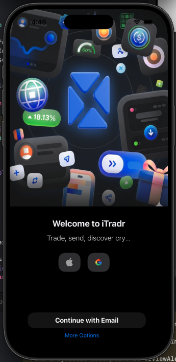
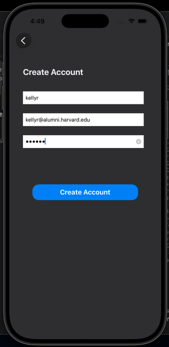
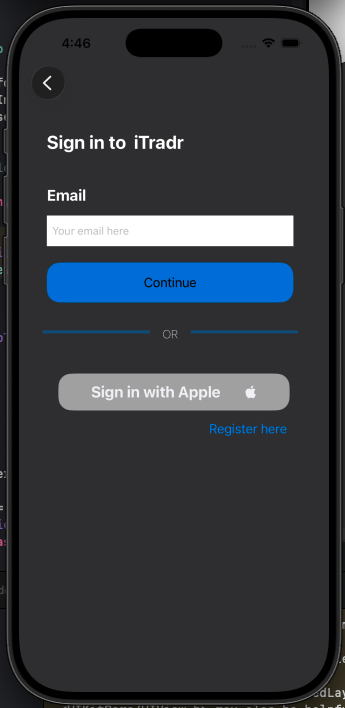
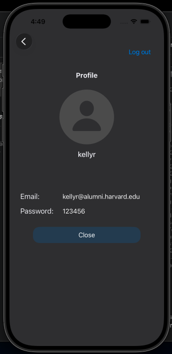

# 📱 iOS Login & Registration

A native iOS mobile application implementing a complete and secure user authentication flow. This project demonstrates best practices in software architecture, real-time data validation, and hierarchical navigation management using native containers.

---

## 📸 Screenshots

Below is the visual flow of the application, showcasing everything from access control to the final logged-in user experience:

| 1. Home Screen | 2. User Registration |
|:---:|:---:|
|  |  |
| *Credential validation and input error handling.* | *Form interface designed for creating new accounts.* |

| 3. Login Screen | 4. Profile Screen |
|:---:|:---:|
|  |  |
| *Interactive feedback using `UIAlertController`.* | *Successful session dashboard with dynamic data injection.* |

## Data Flow

Centering and displaying the animated workflow of the application:

  

